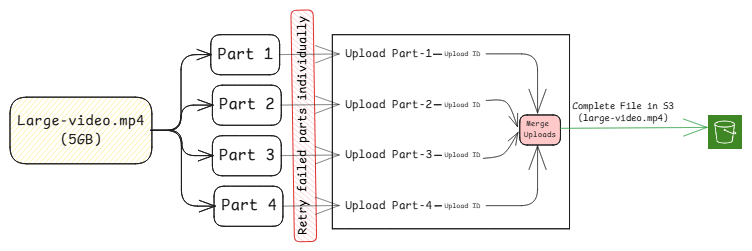
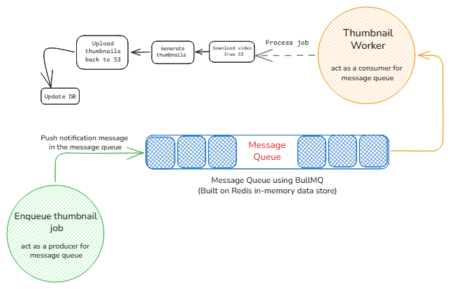
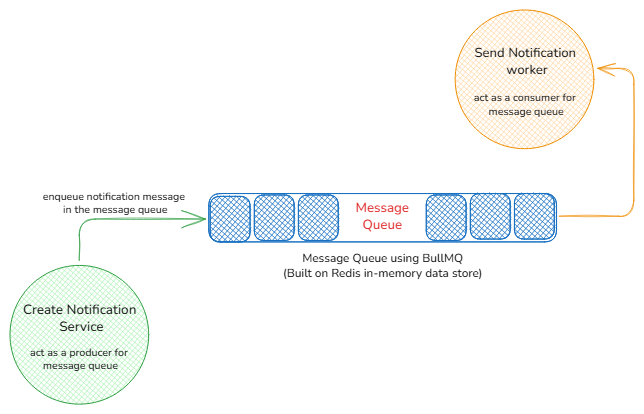
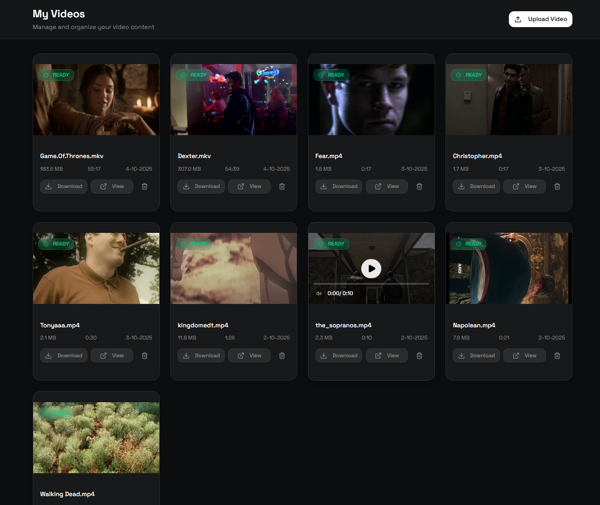
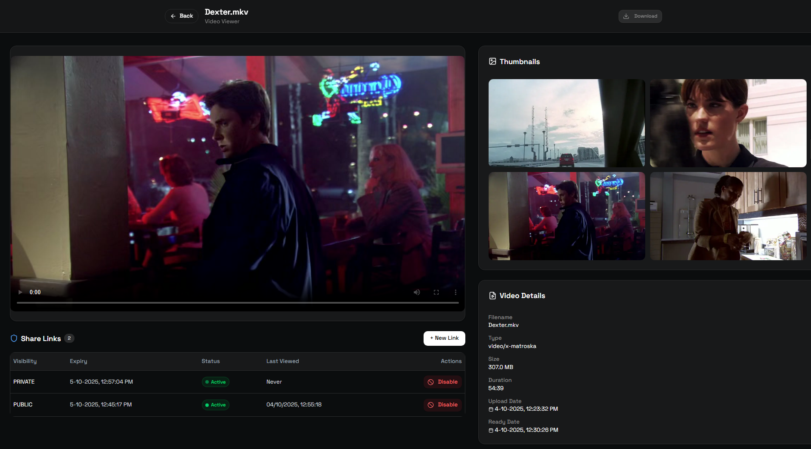
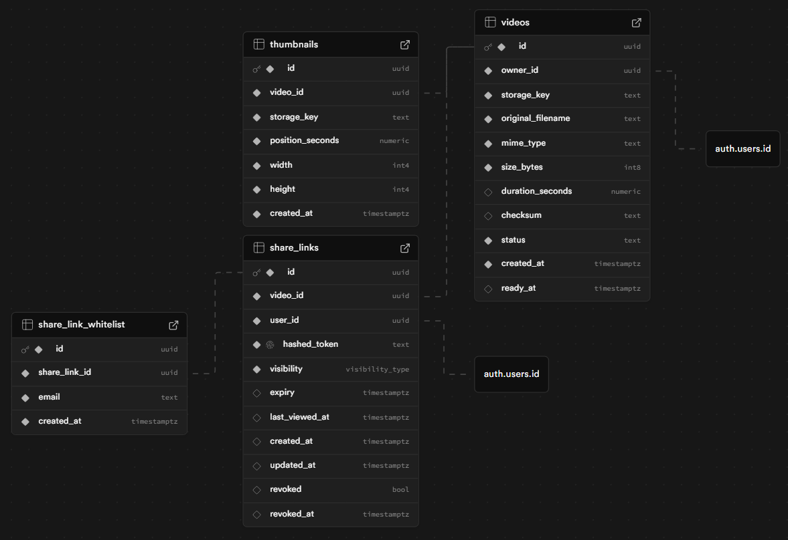

# 🎥 VidVault – Video Upload & Sharing Platform

[](https://github.com/Rupesh-Piwal/finsync)   [](https://x.com/intent/follow?screen_name=rpmarch21)

**VidVault** is a full-stack video management platform with real-time uploads, background processing, and secure shareable links. Built with **Next.js, Supabase, AWS S3 (presigned URLs), BullMQ, and Redis**, it’s fast, reliable, and production-ready.

[]()

## Demo

#### VIDEO DEMO 👉🏻 [Click to see VIDEO-DEMO](https://drive.google.com/file/d/1kIBYPanK2UbRBiyZ2eSNtfw8VyOU9VNg/view?usp=sharing)


#### LIVE DEMO 👉🏻 [Click to visit VidVault](https://vidsvault.vercel.app/)

#### GITHUB REPO 👉🏻 [Click to visit Codebase](https://github.com/Rupesh-Piwal/video-vault)

#### PORTFOLIO 👉🏻 [View My Portfolio](https://rupesh-piwal-portfolio.vercel.app)

---

## 🎯 Key Features

### 📤 Upload (Multipart)



- Only authenticated users can upload (via Supabase Auth)
- Uploads use **AWS S3 Multipart Upload** with presigned URLs
  - Large files split into smaller parts
  - Each part uploaded independently
  - Failed parts retried with exponential backoff
  - Resumable and parallel transfers
- Real-time progress bar showing bytes and % uploaded
- Post-upload status lifecycle: **UPLOADING → PROCESSING → READY**

---

### 🗄️ Storage & Processing



- Videos stored in **object storage** (AWS S3 or Supabase storage)
- **Background workers** handle heavy tasks asynchronously
- Upload Service enqueues a job into **BullMQ Message Queue (Redis)**
- Thumbnail Worker consumes job → downloads video from S3 → generates 3 thumbnails → uploads back to S3 → updates Supabase DB
- Supports **retries with exponential backoff, idempotency, and error handling**

---

### 🔗 Share Links



- Multiple links per video
- **Visibility**: PUBLIC or PRIVATE (whitelisted emails only)
- **Expiry presets**: 1h, 12h, 1d, 30d, Forever
- Tracks **last_viewed_at** for analytics
- PRIVATE links: if whitelisted email matches a registered user → send **email notification instantly**

---

## 📸 ScreenShots




---

## 🗂️ Database Schema



---

## 🛠️ Technologies Used

| Layer       | Stack                                                |
| ----------- | ---------------------------------------------------- |
| Frontend    | Next.js 15 (App Router), TypeScript, Tailwind/Shadcn |
| Backend     | Node.js, API Routes                                  |
| Auth        | Supabase Auth                                        |
| Storage     | AWS S3 (Multipart Upload via Presigned URLs)         |
| Database    | Postgres (Supabase)                                  |
| Jobs        | BullMQ + Redis (background async workers)            |
| Queue Tasks | Thumbnail Worker, Email Worker                       |
| DevEnv      | Docker                                               |
| Deployment  | Vercel, Render                                       |

---

## 🚀 Getting Started

### Clone & Install

```bash
git clone https://github.com/Rupesh-Piwal/video-vault.git
cd video-vault
npm install
```

### Setup Environment (Client)

```env
NEXT_PUBLIC_SUPABASE_URL=xxxxxxxxxxxxxxxxxxxxx
NEXT_PUBLIC_SUPABASE_PUBLISHABLE_KEY=xxxxxxxxxxxxxxxxxx
SUPABASE_SERVICE_ROLE_KEY=xxxxxxxxxxxxxxxxxxx
AWS_ACCESS_KEY_ID=xxxxxxxxxxxxxxxxxxx
AWS_SECRET_ACCESS_KEY=xxxxxxxxxxxxxxxx
AWS_BUCKET_REGION=xx-xxx-xx
NEXT_PUBLIC_AWS_BUCKET_NAME=xxx-xx-xx
REDIS_URL=redis://localhost:6379
NEXT_PUBLIC_EXPRESS_URL=http://localhost:4000
NEXT_PUBLIC_APP_URL=http://localhost:3000

```

### Setup Environment (Server)

```env
SUPABASE_URL=xxxxxxxxxxxxxxxxxxxxxxxxxxxxxxx
SUPABASE_PUBLISHABLE_KEY=xxxxxxxxxxxxxxxxxxx
SUPABASE_SERVICE_ROLE_KEY=xxxxxxxxxxxxxxxxxx
AWS_ACCESS_KEY_ID=xxxxxxxxxxxxxxxxxxx
AWS_SECRET_ACCESS_KEY=xxxxxxxxxxxxxxxxx
AWS_BUCKET_REGION=xxx-xxx-xx
AWS_BUCKET_NAME=xx-xx-xxx
REDIS_URL=redis://localhost:6379
RESEND_API_KEY=xxxxxxxxxxxxxxxxx
APP_URL=http://localhost:4000
NEXT_PUBLIC_APP_URL=http://localhost:3000

```

# Running Redis Locally

You can run Redis locally in a few ways depending on your setup.

---

## Using Docker (Recommended)

```bash
docker run --name redis-local -p 6379:6379 -d redis
---

## 🤝 Contributing

Contributions are welcome!

1. Fork the repository
2. Create a feature branch (`git checkout -b feat/your-feature`)
3. Commit your changes
4. Push to GitHub
5. Create a Pull Request
```

---

Feel free to reach out to me for guidance or collaboration:

[](mailto:rpiwal02@gmail.com)
